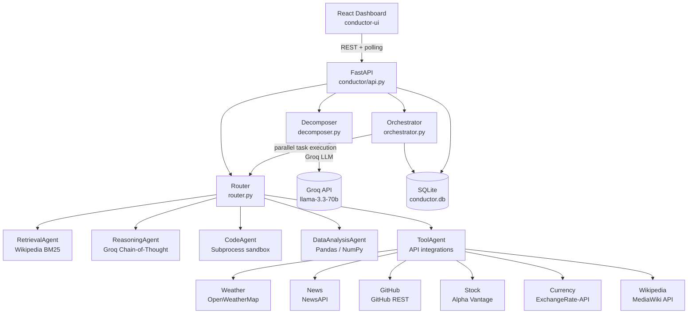

# CONDUCTOR — Multi-Agent Orchestration OS

> Decompose natural-language queries into atomic subtasks and route them across specialized AI agents, all observable through a real-time terminal-style dashboard.

```
                    ┌──────────────────────────────────┐
                    │         User Query                │
                    └────────────────┬─────────────────┘
                                     │
                    ┌────────────────▼─────────────────┐
                    │         Decomposer               │
                    │    (Groq llama-3.3-70b)          │
                    │  "What is the weather in NYC     │
                    │   and latest AI news?"           │
                    └──────┬──────────────┬────────────┘
                           │              │
              ┌────────────▼───┐   ┌──────▼──────────┐
              │  Task 1        │   │  Task 2         │
              │  weather:NYC   │   │  news:AI        │
              └────────────────┘   └─────────────────┘
                     │                    │
         ┌───────────▼──┐      ┌──────────▼──────────┐
         │  ToolAgent   │      │  ToolAgent          │
         │  (weather)   │      │  (news)             │
         └──────────────┘      └─────────────────────┘
                     │                    │
              ┌──────▼────────────────────▼─────┐
              │           Orchestrator           │
              │  aggregates results, persists    │
              └──────────────────────────────────┘
                                 │
              ┌──────────────────▼───────────────┐
              │        CONDUCTOR Dashboard        │
              │  (React + terminal aesthetic)     │
              └──────────────────────────────────┘
```

## Architecture



## Agents

| Agent | ID | Capabilities | Requires Key |
|---|---|---|---|
| RetrievalAgent | `retrieval` | Wikipedia BM25 search | No |
| ReasoningAgent | `reasoning` | Groq chain-of-thought | `GROQ_API_KEY` |
| CodeAgent | `code` | Python subprocess execution | No (Groq optional) |
| DataAnalysisAgent | `data_analysis` | Pandas/NumPy stats | No (Groq optional) |
| ToolAgent | `tool` | Weather, News, GitHub, Stock, Currency | Per-tool keys |

## API Integrations

| Tool | Provider | Env Var | Free Tier |
|---|---|---|---|
| Weather | OpenWeatherMap | `OPENWEATHER_API_KEY` | 1,000 req/day |
| News | NewsAPI | `NEWSAPI_API_KEY` | 100 req/day |
| GitHub | GitHub REST | `GITHUB_TOKEN` | 5,000 req/hr |
| Stock | Alpha Vantage | `ALPHA_VANTAGE_KEY` | 25 req/day |
| Currency | ExchangeRate-API | `EXCHANGERATE_API_KEY` | 1,500 req/mo |

## Quick Start

### Option 1: Docker Compose (recommended)

```bash
cp .env.example .env          # add your API keys
docker-compose up --build
```

- API: http://localhost:8080/api/healthz
- Dashboard: http://localhost:3000

### Option 2: Local Development

```bash
make install    # install Python deps + Node deps
make dev        # start API server + dashboard concurrently
```

### Option 3: Manual

```bash
# Backend
cd artifacts/api-server
pip install -r requirements.txt
uvicorn conductor.api:app --host 0.0.0.0 --port 8080 --reload

# Frontend (separate terminal)
cd artifacts/conductor-ui
pnpm dev
```

## Environment Variables

Copy `.env.example` to `.env` and fill in your keys:

```bash
GROQ_API_KEY=gsk_...
OPENWEATHER_API_KEY=...
NEWSAPI_API_KEY=...
GITHUB_TOKEN=ghp_...
ALPHA_VANTAGE_KEY=...
EXCHANGERATE_API_KEY=...
```

Keys are optional — agents that don't need them (Retrieval, Code, DataAnalysis) work without any configuration.

## REST API

| Method | Endpoint | Description |
|---|---|---|
| `GET` | `/api/healthz` | Health check |
| `POST` | `/api/queries` | Submit a new query |
| `GET` | `/api/queries` | List queries (filter by status) |
| `GET` | `/api/queries/{id}` | Get query with full trace |
| `POST` | `/api/queries/{id}/cancel` | Cancel a running query |
| `GET` | `/api/agents` | List agents with live stats |
| `GET` | `/api/stats` | System-wide metrics |
| `GET` | `/api/stats/dashboard` | Dashboard summary |
| `POST` | `/api/benchmark/run` | Start a benchmark suite |
| `GET` | `/api/benchmark/results` | List benchmark results |

### Example: Submit a query

```bash
curl -X POST http://localhost:8080/api/queries \
  -H "Content-Type: application/json" \
  -d '{"query": "What is the weather in London and latest AI news?"}'
```

## Running Tests

```bash
make test               # run all tests
make test-coverage      # with coverage report
```

Tests cover: models, router, decomposer, tool registry, agents (>80% target coverage).

## Running Benchmarks

```bash
make benchmark-quick    # 5 tasks (~1 min)
make benchmark-full     # 20 tasks (~5 min)

# Or directly:
cd artifacts/api-server
python benchmarks/evaluate.py --suite quick --output report.json
```

## Adding a New Agent

1. **Create** `conductor/agents/my_agent.py` extending `Agent`:

```python
from conductor.agents.base import Agent, AgentResult
from conductor.models import TaskModel

class MyAgent(Agent):
    agent_id = "my_agent"
    name = "MyAgent"
    description = "Does something specialized"
    capabilities = ["my-capability", "another-cap"]

    async def execute(self, task: TaskModel, context: dict[str, str]) -> AgentResult:
        result = do_work(task.description)
        return AgentResult(success=True, output=result)
```

2. **Register** it in `conductor/router.py` inside `_register_defaults()`:

```python
from conductor.agents.my_agent import MyAgent
self._agents["my_agent"] = MyAgent()
```

3. **Add routing rules** in `CAPABILITY_ROUTING` (same file):

```python
"my-capability": ["my_agent", "reasoning"],  # fallback to reasoning
```

4. **Add tests** in `tests/test_agents.py` and `tests/test_router.py`.

## Project Structure

```
artifacts/
├── api-server/
│   ├── conductor/
│   │   ├── agents/          # 5 agent implementations
│   │   ├── tools/           # 6 API client integrations
│   │   ├── api.py           # FastAPI app + endpoints
│   │   ├── decomposer.py    # LLM query decomposition
│   │   ├── orchestrator.py  # DAG execution engine
│   │   ├── router.py        # Capability-based routing
│   │   ├── database.py      # SQLite persistence
│   │   └── models.py        # Pydantic data models
│   ├── benchmarks/
│   │   └── evaluate.py      # Benchmark harness
│   ├── tests/               # pytest test suite
│   ├── requirements.txt
│   └── start.sh
├── conductor-ui/
│   └── src/
│       ├── pages/           # Dashboard, Queries, Agents, Benchmark, Run
│       └── components/      # shadcn/ui components
└── lib/
    ├── api-spec/openapi.yaml
    ├── api-client-react/    # Orval-generated React hooks
    └── api-zod/             # Orval-generated Zod schemas
```

## License

MIT
